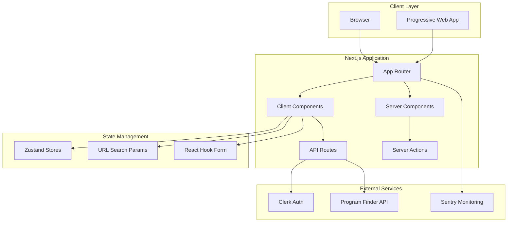
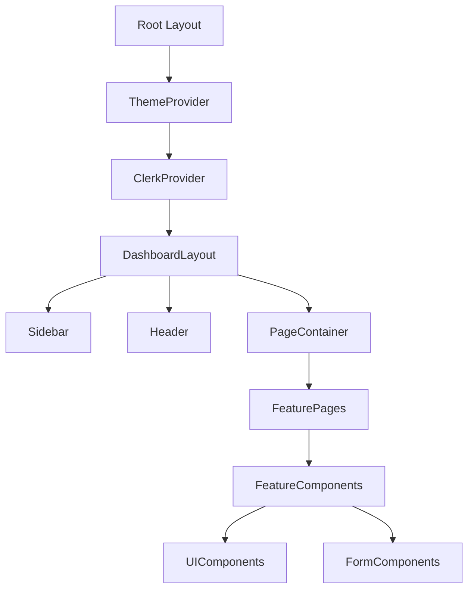
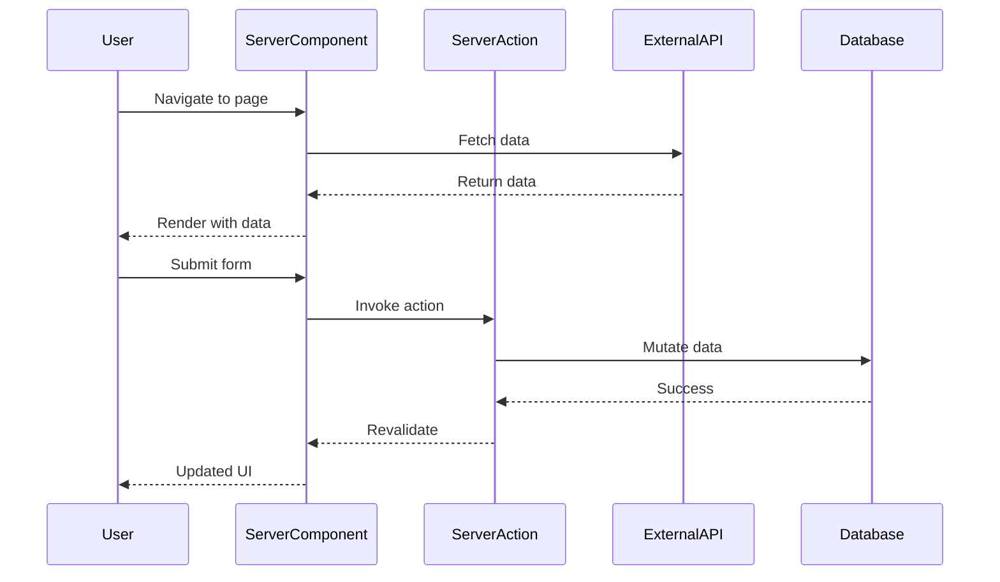
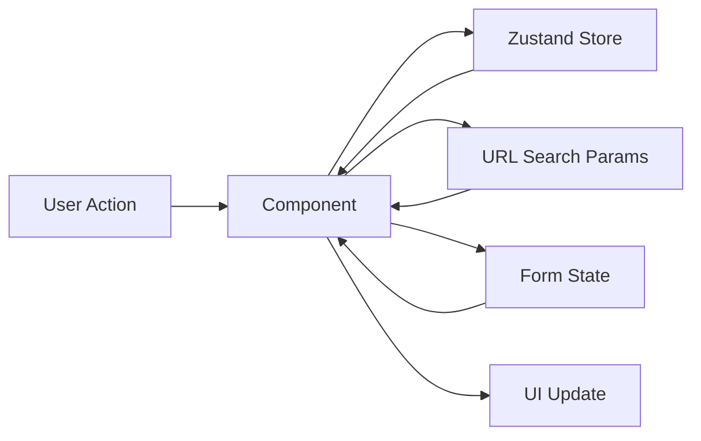
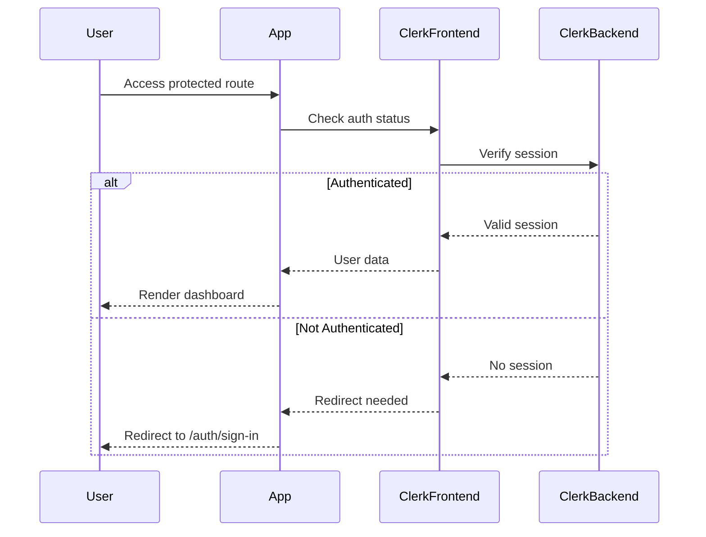

# Architecture Documentation

> System design and technical architecture for Funders Portal

## Table of Contents

- [Overview](#overview)
- [Architecture Principles](#architecture-principles)
- [System Architecture](#system-architecture)
- [Frontend Architecture](#frontend-architecture)
- [Data Flow](#data-flow)
- [Authentication & Authorization](#authentication--authorization)
- [State Management](#state-management)
- [API Integration](#api-integration)
- [File Structure](#file-structure)
- [Component Architecture](#component-architecture)
- [Performance Optimization](#performance-optimization)

## Overview

Funders Portal is built as a modern, server-side rendered React application using Next.js 16 with the App Router. The architecture follows a **feature-based organization** pattern, promoting modularity, maintainability, and scalability.

### Core Design Goals

1. **Scalability** - Feature-based structure allows independent development and scaling
2. **Performance** - Server components, streaming, and optimized rendering
3. **Type Safety** - End-to-end TypeScript with Zod validation
4. **Developer Experience** - Clear patterns, excellent tooling, and comprehensive documentation
5. **User Experience** - Fast, responsive, and accessible interface

## Architecture Principles

### 1. Feature-Based Organization

Each major feature (open-calls, bilateral-engagements, opportunities, team) is self-contained with its own:
- Components
- Business logic
- Schemas
- Utilities
- Types

This promotes:
- **Cohesion** - Related code stays together
- **Encapsulation** - Features have clear boundaries
- **Reusability** - Shared code lives in `/components` and `/lib`
- **Scalability** - Teams can work on features independently

### 2. Server-First Approach

Leveraging Next.js 16 App Router capabilities:
- **React Server Components (RSC)** - Default to server components
- **Server Actions** - Form submissions and mutations
- **Streaming** - Progressive page rendering
- **Metadata API** - SEO optimization at every level

### 3. Progressive Enhancement

- Core functionality works without JavaScript
- Enhanced interactions with client components
- Graceful degradation for older browsers

## System Architecture



## Frontend Architecture

### Next.js App Router Structure

```
src/app/
├── layout.tsx              # Root layout (server component)
├── page.tsx                # Landing page
├── sitemap.ts              # Dynamic sitemap
├── (auth)/                 # Route group for auth
│   └── sign-in/
│       └── page.tsx
└── dashboard/              # Main application
    ├── layout.tsx          # Dashboard layout
    ├── page.tsx            # Dashboard redirect
    ├── open-calls/
    │   ├── page.tsx        # List view (server component)
    │   └── [id]/
    │       └── page.tsx    # Detail view
    ├── bilateral-engagements/
    ├── opportunities/
    ├── team/
    └── overview/
        ├── layout.tsx      # Parallel routes layout
        ├── @area_stats/    # Parallel route slot
        ├── @bar_stats/
        ├── @pie_stats/
        └── @sales/
```

### Component Hierarchy



## Data Flow

### Server-Side Data Flow



### Client-Side State Flow



## Authentication & Authorization

### Clerk Integration

Funders Portal uses [Clerk](https://clerk.com) for authentication and user management.

**Authentication Flow:**



**Protection Levels:**

1. **Public Routes** - No authentication required
   - Landing page (`/`)
   
2. **Authenticated Routes** - Must be signed in
   - All `/dashboard/*` routes
   - Protected via middleware and layout checks

3. **Role-Based Access** (Future)
   - Admin-only routes
   - Organization-based permissions

## State Management

### 1. Server State (React Server Components)

Data fetched on the server and passed as props:
- Initial page data
- Search/filter params from URL
- User information from Clerk

### 2. URL State (Nuqs)

Type-safe search params for:
- Pagination (`page`, `limit`)
- Search queries (`q`)
- Filters (`categories`, `status`)
- Sorting (`sort`, `order`)

```typescript
// Example: src/lib/searchparams.ts
import { createSearchParamsCache, parseAsInteger, parseAsString } from 'nuqs/server';

export const searchParamsCache = createSearchParamsCache({
  page: parseAsInteger.withDefault(1),
  limit: parseAsInteger.withDefault(10),
  q: parseAsString.withDefault(''),
  categories: parseAsString.withDefault('')
});
```

### 3. Client State (Zustand)

Lightweight state for:
- UI state (sidebar open/closed, modals)
- Temporary data (kanban board, drag-and-drop)
- User preferences

```typescript
// Example store
import { create } from 'zustand';

interface DashboardStore {
  sidebarOpen: boolean;
  toggleSidebar: () => void;
}

export const useDashboardStore = create<DashboardStore>((set) => ({
  sidebarOpen: true,
  toggleSidebar: () => set((state) => ({ sidebarOpen: !state.sidebarOpen }))
}));
```

### 4. Form State (React Hook Form + Zod)

Form management with:
- Validation schemas (Zod)
- Form state management (React Hook Form)
- Server action integration

```typescript
// Example form
const schema = z.object({
  title: z.string().min(1, 'Title is required'),
  description: z.string().min(10, 'Description must be at least 10 characters')
});

type FormData = z.infer<typeof schema>;

const form = useForm<FormData>({
  resolver: zodResolver(schema)
});
```

## API Integration

### External APIs

#### Program Finder API

Integrated for opportunity discovery:

```typescript
// Endpoint
const PROGRAM_FINDER_API = 'https://data-visualizer-agent-production.up.railway.app/program_finder/find_programs';

// Usage in server component
async function fetchOpportunities(criteria: SearchCriteria) {
  const response = await fetch(PROGRAM_FINDER_API, {
    method: 'POST',
    headers: { 'Content-Type': 'application/json' },
    body: JSON.stringify(criteria)
  });
  
  return response.json();
}
```

### Internal API Routes

API routes for server-side operations:
- `/api/webhooks/clerk` - Clerk webhook handlers
- Future: `/api/applications`, `/api/engagements`, etc.

## File Structure

### Feature Module Pattern

Each feature follows this structure:

```
src/features/[feature-name]/
├── components/
│   ├── [feature]-listing.tsx      # List view
│   ├── [feature]-tables.tsx       # Table component
│   ├── [feature]-form.tsx         # Form component
│   └── [feature]-view-page.tsx    # Detail view
├── schemas/
│   └── [feature]-schema.ts        # Zod validation schemas
├── actions/
│   └── [feature]-actions.ts       # Server actions
└── utils/
    └── [feature]-utils.ts         # Feature-specific utilities
```

### Shared Resources

```
src/
├── components/
│   ├── ui/              # Shadcn UI primitives
│   ├── layout/          # Layout components
│   └── forms/           # Reusable form components
├── lib/
│   ├── utils.ts         # Helper functions
│   ├── metadata.ts      # SEO utilities
│   └── font.ts          # Font configuration
├── hooks/
│   ├── use-debounce.ts
│   └── use-media-query.ts
└── types/
    └── index.ts         # Shared TypeScript types
```

## Component Architecture

### Component Categories

1. **Server Components** (Default)
   - Page components
   - Layout components
   - Static data displays
   - No interactivity needed

2. **Client Components** (`'use client'`)
   - Interactive UI elements
   - Form inputs
   - State-dependent components
   - Event handlers

3. **Hybrid Components**
   - Server component wrapper
   - Client component children
   - Best of both worlds

### Example: Table Architecture

```tsx
// Server Component (page.tsx)
export default async function OpenCallsPage() {
  const data = await fetchOpenCalls(); // Server-side fetch
  
  return <OpenCallsTable data={data} />; // Pass to client
}

// Client Component (table.tsx)
'use client';

export function OpenCallsTable({ data }: { data: OpenCall[] }) {
  const [sorting, setSorting] = useState([]); // Client state
  const [filtering, setFiltering] = useQueryStates(searchParamsParser); // URL state
  
  // Interactive table with sort, filter, pagination
  return <DataTable ... />;
}
```

## Performance Optimization

### Next.js Optimizations

1. **Image Optimization**
   ```tsx
   import Image from 'next/image';
   
   <Image
     src="/logo.svg"
     alt="Logo"
     width={200}
     height={50}
     priority // Above the fold
   />
   ```

2. **Font Optimization**
   ```tsx
   import { Inter } from 'next/font/google';
   
   const inter = Inter({ subsets: ['latin'] });
   ```

3. **Bundle Optimization**
   - Dynamic imports for heavy components
   - Code splitting by route
   - Tree shaking unused code

4. **Caching Strategy**
   - Static pages cached at CDN
   - Revalidation on-demand
   - Streaming for dynamic content

### React Optimizations

1. **Minimize Client Bundles**
   - Default to server components
   - Only add `'use client'` when needed

2. **Memoization**
   ```tsx
   const memoizedValue = useMemo(() => expensiveCalc(data), [data]);
   ```

3. **Debouncing**
   ```tsx
   const debouncedSearch = useDebounce(searchTerm, 300);
   ```

### Monitoring

- **Sentry** - Error tracking and performance monitoring
- **Next.js Analytics** - Core Web Vitals tracking
- **Lighthouse** - Regular performance audits

## Security Considerations

1. **Authentication** - All routes protected via Clerk
2. **Authorization** - Role-based access control
3. **Data Validation** - Zod schemas on client and server
4. **Rate Limiting** - API route protection (future)
5. **Content Security Policy** - XSS prevention
6. **Environment Variables** - Sensitive data protection

## Scalability Roadmap

### Short Term
- [ ] Database integration (PostgreSQL/MongoDB)
- [ ] API layer for CRUD operations
- [ ] Caching layer (Redis)
- [ ] Background jobs (for notifications)

### Medium Term
- [ ] Multi-tenancy support
- [ ] Advanced search (Elasticsearch/Algolia)
- [ ] Real-time updates (WebSockets/Server-Sent Events)
- [ ] Document storage (S3/CDN)

### Long Term
- [ ] Mobile apps (React Native)
- [ ] Microservices architecture
- [ ] GraphQL API
- [ ] AI-powered recommendations

---

**Last Updated**: December 2024  
**Version**: 1.0.0
