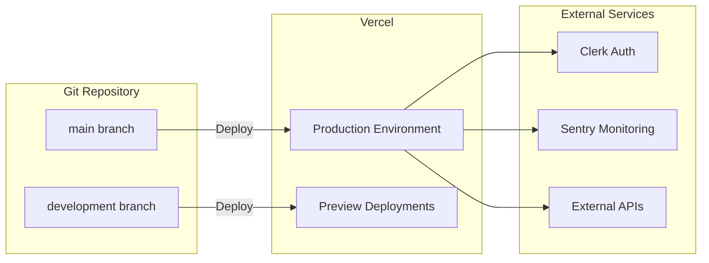

# Deployment Guide

> Production deployment instructions for Funders Portal

## Table of Contents

- [Overview](#overview)
- [Prerequisites](#prerequisites)
- [Environment Configuration](#environment-configuration)
- [Vercel Deployment](#vercel-deployment)
- [Custom Domain Setup](#custom-domain-setup)
- [Database Setup](#database-setup)
- [Post-Deployment Configuration](#post-deployment-configuration)
- [Monitoring & Error Tracking](#monitoring--error-tracking)
- [CI/CD Pipeline](#cicd-pipeline)
- [Troubleshooting](#troubleshooting)

## Overview

Funders Portal is optimized for deployment on [Vercel](https://vercel.com), the platform created by the Next.js team. This guide covers the complete deployment process from environment setup to production monitoring.

### Deployment Architecture



## Prerequisites

Before deploying, ensure you have:

- [ ] A Vercel account ([Sign up here](https://vercel.com/signup))
- [ ] A Clerk account for authentication ([Sign up here](https://clerk.com))
- [ ] A Sentry account for monitoring (optional but recommended)
- [ ] Your git repository pushed to GitHub, GitLab, or Bitbucket
- [ ] Node.js 18+ installed locally for testing

## Environment Configuration

### Required Environment Variables

Create a `.env.production` file or configure in Vercel dashboard:

```env
# Application
NEXT_PUBLIC_APP_URL=https://yourdomain.com

# Clerk Authentication
NEXT_PUBLIC_CLERK_PUBLISHABLE_KEY=pk_live_xxxxx
CLERK_SECRET_KEY=sk_live_xxxxx
NEXT_PUBLIC_CLERK_SIGN_IN_URL=/auth/sign-in
NEXT_PUBLIC_CLERK_SIGN_UP_URL=/auth/sign-up
NEXT_PUBLIC_CLERK_AFTER_SIGN_IN_URL=/dashboard/overview
NEXT_PUBLIC_CLERK_AFTER_SIGN_UP_URL=/dashboard/overview

# Clerk Webhooks
CLERK_WEBHOOK_SECRET=whsec_xxxxx

# Sentry (Optional but Recommended)
NEXT_PUBLIC_SENTRY_DSN=https://xxxxx@xxxxx.ingest.sentry.io/xxxxx
NEXT_PUBLIC_SENTRY_ORG=your-org-name
NEXT_PUBLIC_SENTRY_PROJECT=funders-portal
SENTRY_AUTH_TOKEN=xxxxx

# To disable Sentry in development
# NEXT_PUBLIC_SENTRY_DISABLED=true
```

### Environment Variable Security

- **Never commit** `.env.local` or `.env.production` to git
- **Use Vercel's dashboard** to manage production secrets
- **Rotate keys regularly** for security
- **Use different keys** for preview and production

## Vercel Deployment

### Method 1: Vercel Dashboard (Recommended)

1. **Import Your Repository**

   - Go to [vercel.com/new](https://vercel.com/new)
   - Click "Import Project"
   - Select your git provider (GitHub/GitLab/Bitbucket)
   - Choose the `funders-portal` repository

2. **Configure Project**

   ```
   Framework Preset: Next.js
   Root Directory: ./
   Build Command: npm run build (auto-detected)
   Output Directory: .next (auto-detected)
   Install Command: npm install
   ```

3. **Add Environment Variables**

   - Click "Environment Variables"
   - Add all variables from [Environment Configuration](#environment-configuration)
   - Choose which environments (Production, Preview, Development)

4. **Deploy**

   - Click "Deploy"
   - Wait 2-5 minutes for initial deployment
   - Vercel will provide a `.vercel.app` URL

### Method 2: Vercel CLI

1. **Install Vercel CLI**

   ```bash
   npm install -g vercel
   ```

2. **Login to Vercel**

   ```bash
   vercel login
   ```

3. **Link Project**

   ```bash
   cd /path/to/funders-portal
   vercel link
   ```

4. **Set Environment Variables**

   ```bash
   vercel env add NEXT_PUBLIC_CLERK_PUBLISHABLE_KEY
   vercel env add CLERK_SECRET_KEY
   # ... add all required variables
   ```

5. **Deploy to Production**

   ```bash
   vercel --prod
   ```

### Method 3: GitHub Integration (Automated)

1. **Connect GitHub**

   - In Vercel dashboard, go to "Project Settings"
   - Connect GitHub repository
   - Enable "Automatic Deployments"

2. **Configure Branches**

   ```yaml
   Production Branch: main
   Preview Branches: All branches
   ```

3. **Push to Deploy**

   ```bash
   git push origin main
   ```

   Vercel automatically deploys any push to `main`.

## Custom Domain Setup

### Add Custom Domain

1. **In Vercel Dashboard**

   - Go to Project Settings → Domains
   - Click "Add"
   - Enter your domain (e.g., `fundersportal.com`)

2. **Configure DNS**

   Add these records at your DNS provider:

   **For apex domain** (`fundersportal.com`):
   ```
   Type: A
   Name: @
   Value: 76.76.21.21
   ```

   **For www subdomain**:
   ```
   Type: CNAME
   Name: www
   Value: cname.vercel-dns.com
   ```

3. **SSL Certificate**

   Vercel automatically provisions SSL certificates via Let's Encrypt.

### Update Environment Variables

After adding domain:

```bash
vercel env add NEXT_PUBLIC_APP_URL production
# Enter: https://fundersportal.com
```

Also update in Clerk dashboard:
- Authorized domains
- Redirect URLs
- Webhook URLs

## Database Setup

### Option 1: MongoDB Atlas (Recommended for Now)

1. **Create Cluster**

   - Sign up at [mongodb.com/cloud/atlas](https://www.mongodb.com/cloud/atlas)
   - Create a free M0 cluster
   - Choose region close to Vercel deployment

2. **Configure Network Access**

   - Add Vercel IP ranges or allow all (`0.0.0.0/0`)

3. **Create Database User**

   - Username: `funders-portal`
   - Password: Generate strong password

4. **Get Connection String**

   ```
   mongodb+srv://funders-portal:<password>@cluster0.xxxxx.mongodb.net/funders-portal?retryWrites=true&w=majority
   ```

5. **Add to Vercel**

   ```bash
   vercel env add MONGODB_URI production
   ```

### Option 2: PostgreSQL (Future)

For structured relational data:
- Vercel Postgres
- Railway
- Supabase
- PlanetScale

## Post-Deployment Configuration

### 1. Clerk Configuration

**Update Authorized Domains:**
```
Dashboard → Settings → Domains
Add: https://fundersportal.com
```

**Update URLs:**
```
Dashboard → Paths
Sign-in URL: /auth/sign-in
Sign-up URL: /auth/sign-up
After sign-in: /dashboard/overview
After sign-up: /dashboard/overview
```

**Configure Webhooks:**
```
Dashboard → Webhooks → Add Endpoint
URL: https://fundersportal.com/api/webhooks/clerk
Events: user.created, user.updated, user.deleted
```

### 2. Verify Sitemap

Visit:
```
https://fundersportal.com/sitemap.xml
```

Should display XML with all routes.

### 3. Submit to Search Engines

**Google Search Console:**
```
https://search.google.com/search-console
```

**Bing Webmaster Tools:**
```
https://www.bing.com/webmasters
```

### 4. Test SEO

**Meta Tags:**
```
https://metatags.io/?url=https://fundersportal.com
```

**Open Graph:**
```
https://www.opengraph.xyz/?url=https://fundersportal.com
```

**Structured Data:**
```
https://search.google.com/test/rich-results
```

## Monitoring & Error Tracking

### Sentry Setup

1. **Create Project**

   - Go to [sentry.io](https://sentry.io)
   - Create new Next.js project
   - Copy DSN

2. **Configure Vercel**

   ```bash
   vercel env add NEXT_PUBLIC_SENTRY_DSN production
   vercel env add NEXT_PUBLIC_SENTRY_ORG production
   vercel env add NEXT_PUBLIC_SENTRY_PROJECT production
   ```

3. **Source Maps Upload**

   ```bash
   # Generate auth token in Sentry
   vercel env add SENTRY_AUTH_TOKEN production
   ```

   Source maps are automatically uploaded during build.

### Vercel Analytics

**Enable in Dashboard:**
- Project Settings → Analytics
- Enable Web Analytics
- Enable Speed Insights

**View Metrics:**
- Core Web Vitals
- Page load times
- Error rates
- Geographic distribution

### Performance Monitoring

**Key Metrics to Monitor:**
- Time to First Byte (TTFB)
- First Contentful Paint (FCP)
- Largest Contentful Paint (LCP)
- Cumulative Layout Shift (CLS)
- First Input Delay (FID)

**Lighthouse CI** (Optional):
```bash
npm install -g @lhci/cli
lhci autorun --upload.target=temporary-public-storage
```

## CI/CD Pipeline

### GitHub Actions

Create `.github/workflows/ci.yml`:

```yaml
name: CI/CD Pipeline

on:
  push:
    branches: [main, development]
  pull_request:
    branches: [main]

jobs:
  lint-and-test:
    runs-on: ubuntu-latest
    
    steps:
      - uses: actions/checkout@v3
      
      - name: Setup Node.js
        uses: actions/setup-node@v3
        with:
          node-version: '18'
          cache: 'npm'
      
      - name: Install dependencies
        run: npm ci
      
      - name: Run linter
        run: npm run lint:strict
      
      - name: Run type check
        run: npx tsc --noEmit
      
      - name: Build
        run: npm run build
        env:
          NEXT_PUBLIC_CLERK_PUBLISHABLE_KEY: ${{ secrets.NEXT_PUBLIC_CLERK_PUBLISHABLE_KEY }}
          CLERK_SECRET_KEY: ${{ secrets.CLERK_SECRET_KEY }}
  
  deploy:
    needs: lint-and-test
    runs-on: ubuntu-latest
    if: github.ref == 'refs/heads/main'
    
    steps:
      - uses: actions/checkout@v3
      
      - name: Deploy to Vercel
        uses: amondnet/vercel-action@v20
        with:
          vercel-token: ${{ secrets.VERCEL_TOKEN }}
          vercel-org-id: ${{ secrets.VERCEL_ORG_ID }}
          vercel-project-id: ${{ secrets.VERCEL_PROJECT_ID }}
          vercel-args: '--prod'
```

## Troubleshooting

### Build Failures

**Issue**: Build fails with module errors

```bash
# Clear Vercel cache
vercel --force

# Or in dashboard: Settings → Clear Build Cache
```

**Issue**: Environment variables not working

- Check spelling and values in Vercel dashboard
- Ensure variables are set for correct environment
- Redeploy after changing variables

### Runtime Errors

**Issue**: 500 Internal Server Error

- Check Vercel Function Logs
- Review Sentry error reports
- Verify all environment variables are set

**Issue**: Clerk authentication fails

- Verify Clerk environment variables
- Check authorized domains in Clerk dashboard
- Ensure redirect URLs are correct

### Performance Issues

**Issue**: Slow page loads

- Enable Vercel Edge Caching
- Optimize images with next/image
- Review bundle size: `npm run build -- --profile`

**Issue**: High memory usage

- Increase function memory in `vercel.json`:

```json
{
  "functions": {
    "app/**": {
      "memory": 3008
    }
  }
}
```

### SEO Issues

**Issue**: Pages not indexed

- Verify robots.txt allows crawling
- Submit sitemap to search consoles
- Check for `noindex` meta tags

## Advanced Configuration

### Custom Headers

Create `next.config.ts` additions:

```typescript
const securityHeaders = [
  {
    key: 'X-DNS-Prefetch-Control',
    value: 'on'
  },
  {
    key: 'Strict-Transport-Security',
    value: 'max-age=63072000; includeSubDomains; preload'
  },
  {
    key: 'X-Frame-Options',
    value: 'SAMEORIGIN'
  },
  {
    key: 'X-Content-Type-Options',
    value: 'nosniff'
  }
];

export default {
  async headers() {
    return [
      {
        source: '/:path*',
        headers: securityHeaders
      }
    ];
  }
};
```

### Edge Functions

For globally distributed functions:

```typescript
// app/api/route.ts
export const runtime = 'edge';

export async function GET() {
  return new Response('Hello from the edge!');
}
```

---

## Deployment Checklist

- [ ] All environment variables configured
- [ ] Custom domain added and verified
- [ ] SSL certificate active
- [ ] Clerk configuration updated
- [ ] Sentry monitoring enabled
- [ ] Sitemap accessible
- [ ] robots.txt configured
- [ ] Search engines notified
- [ ] Error tracking working
- [ ] Analytics enabled
- [ ] Performance tested
- [ ] CI/CD pipeline configured

---

**Last Updated**: December 2024  
**Version**: 1.0.0
